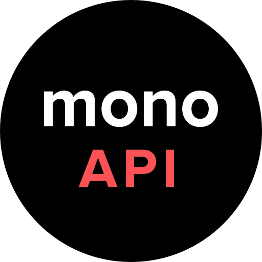
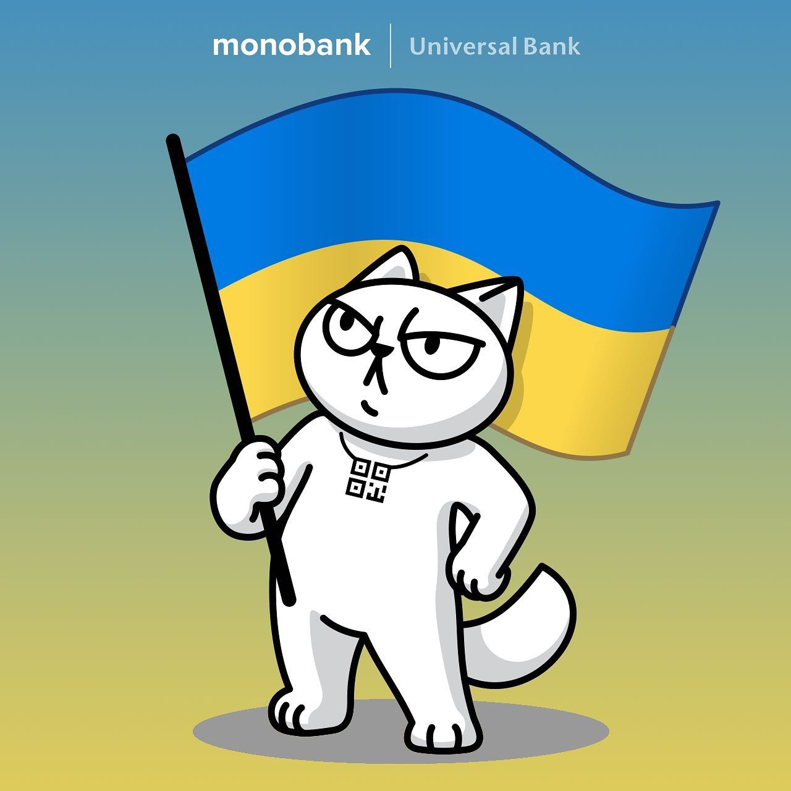

# Go Monobank API

[](https://pkg.go.dev/github.com/FairyTale5571/go-mono)
[](https://goreportcard.com/report/github.com/FairyTale5571/go-mono)
[](https://golang.org)
[]()



## Введення

**Цей пакет ще на етапі розробки, тому не рекомендується використовувати його в продакшені.**

SDK для використання [Monobank API](https://api.monobank.ua/docs) в Go проектах

## Встановлення

```bash
go get github.com/FairyTale5571/go-mono
```

## Реалізовано

- [X] [Публічне API](https://api.monobank.ua/docs) - [Приклад використання](example/public/main.go)
  - [ ] [Corporate API](https://api.monobank.ua/docs/corporate.html)
- [X] [Еквайрінг](https://api.monobank.ua/docs/acquiring.html)
    - [X] Інвойси
    - [X] Мерчанти
    - [X] QR-Каси
- [ ] [Оплата частинами](https://u2-demo-ext.monobank.ua/docs/index.html)
- [ ] [Expirenza - Shake to Pay](https://api.shaketopay.com.ua/) SDK
- [ ] Тести 

## Документація
- [Документація GoDev](https://pkg.go.dev/github.com/FairyTale5571/go-mono)

## Підтримка проекту

Якщо ви хочете підтримати проект, ви можете зробити це за допомогою 

- [Monobank](https://send.monobank.ua/jar/4yAFaAPmgo)
- Картка `5375411212887207` (Monobank)

